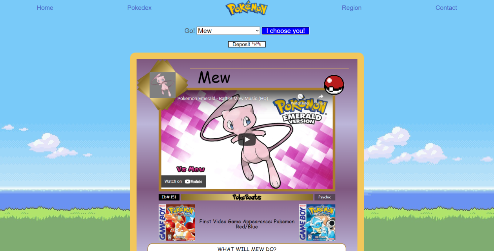

# PokeBeats

## Description

The goal of this project was to use the pokeAPI so we can access information about the pokemon that we have in the dropdown box on our homepage. After choosing your pokemon it will display the pokemon and a song related to them. You can view other pokemon not in our dropdown by clicking on the pokedex tab on the top. We also added a link to the pokemon main page by clicking on the pokemon logo and a link to our contact information in the contact tab.

## Table of Contents

- [Usage](#usage)
- [Technologies](#technologies)
- [Preview](#preview)
- [Contributors](#credit)
- [Launch](#launch)

## Usage

This webpage will let users choose a pokemon and display there music alongside them. Great for those who are fans and will appreciate the design of the website since it references many different element across the pokemon universe. Also great for people new to pokemon and want to learn more about it.

## Technologies

- HTML5
- CSS
- Javascript
- [Bulma](https://bulma.io/)
- [Youtube API](https://developers.google.com/youtube/v3)
- [Pokemon API](https://pokeapi.co/)

## Preview

## Contributors

[Quynh Dinh](https://github.com/quynhndinh), [Anthony Jimenez](https://github.com/Dominiscus1), [Marc Negron](https://github.com/negronmarc), [Harrison Oliner](https://github.com/Harrison-Oliner)

## Launch

[PokeBeats](https://negronmarc.github.io/PokeBeats/index.html)
